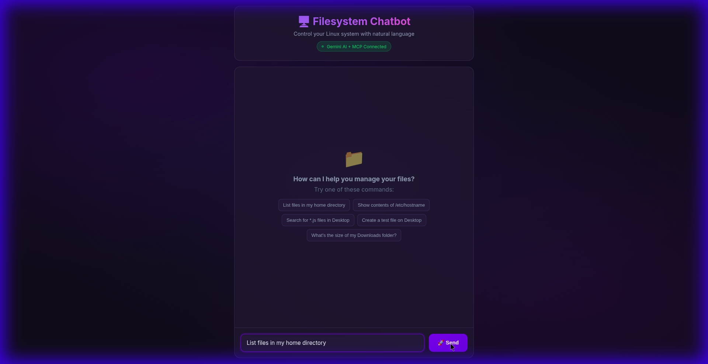

# Filesystem Chatbot

A powerful, secure, and professional web interface that allows you to control your Linux filesystem using natural language powered by Google's Gemini AI and the Model Context Protocol (MCP).



## Overview

Filesystem Chatbot bridges the gap between natural language and complex system operations. Instead of remembering intricate terminal commands, simply tell the AI what you want to do. Whether it's organizing files, searching for documents, or generating code, the AI handles the underlying operations securely via the MCP filesystem server.

## Features

- **Natural Language Control**: Manage files and directories using plain English.
- **Full Filesystem Access**: Read, write, list, search, and move files across your system (configured for root `/` access).
- **Intelligent Assistant**: Powered by Gemini 2.5 Flash for high-speed, accurate reasoning.
- **Secure Architecture**: Built on the standardized Model Context Protocol (MCP) for safe tool execution.
- **Modern UI**: A professional, dark-themed React interface with glassmorphism design.
- **Real-time Feedback**: Instant visibility into tool execution and command results.

## Technology Stack

- **Frontend**: React, Vite, CSS Modules (Glassmorphism design)
- **Backend**: Node.js, Express
- **AI Integration**: Google Gemini API (gemini-2.5-flash)
- **Protocol**: Model Context Protocol (MCP) - *@modelcontextprotocol/server-filesystem*
- **Containerization**: Docker

## Prerequisites

- Node.js v16+ (for local development)
- Docker (for containerized deployment)
- A Google Gemini API Key (Get it from [Google AI Studio](https://aistudio.google.com/apikey))

## Quick Start (Local)

1.  **Clone the repository** (if using git):
    ```bash
    git clone <repository-url>
    cd filesystem-chatbot
    ```

2.  **Configure Environment**:
    Copy the example environment file and add your API key.
    ```bash
    cp .env.example .env
    nano .env
    # Add your GEMINI_API_KEY
    ```

3.  **Start the Application**:
    We provide a convenient startup script.
    ```bash
    ./start.sh
    ```
    
    This will install all dependencies and start both the backend (port 3001) and frontend (port 5173).

4.  **Access the UI**:
    Open your browser to `http://localhost:5173`

## Running with Docker

Build and run the application in a single container.

1.  **Build the Image**:
    ```bash
    docker build -t filesystem-chatbot .
    ```

2.  **Run the Container**:
    Pass your API key as an environment variable. We mount the host root directory to `/data` in the container so the chatbot can access your actual files.
    
    ```bash
    docker run -p 3001:3001 \
      -e GEMINI_API_KEY=your_api_key_here \
      -v /:/data \
      filesystem-chatbot
    ```

    *Note: The `-v /:/data` flag gives the container access to your host's filesystem at `/data`. Without this, it will only access files inside the container.*

## Architecture

The application consists of three main components:

1.  **React Frontend**: Handles user input and displays chat history and tool results.
2.  **Express Server**: Manages the session and communicates with the Gemini API.
3.  **MCP Client**: Spawns and communicates with the standard MCP Filesystem Server via stdio.

## License

MIT License
